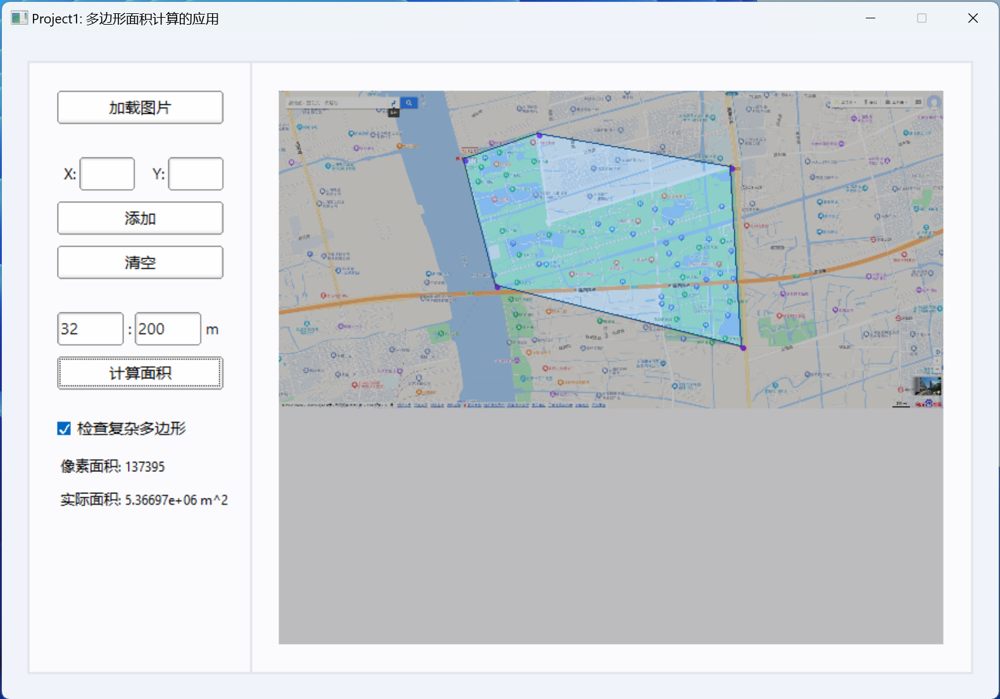
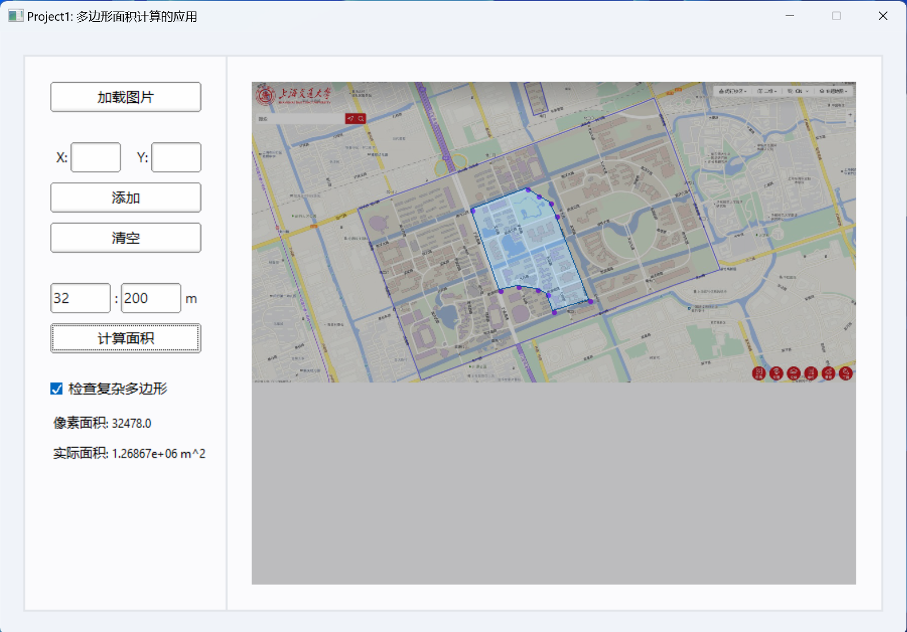
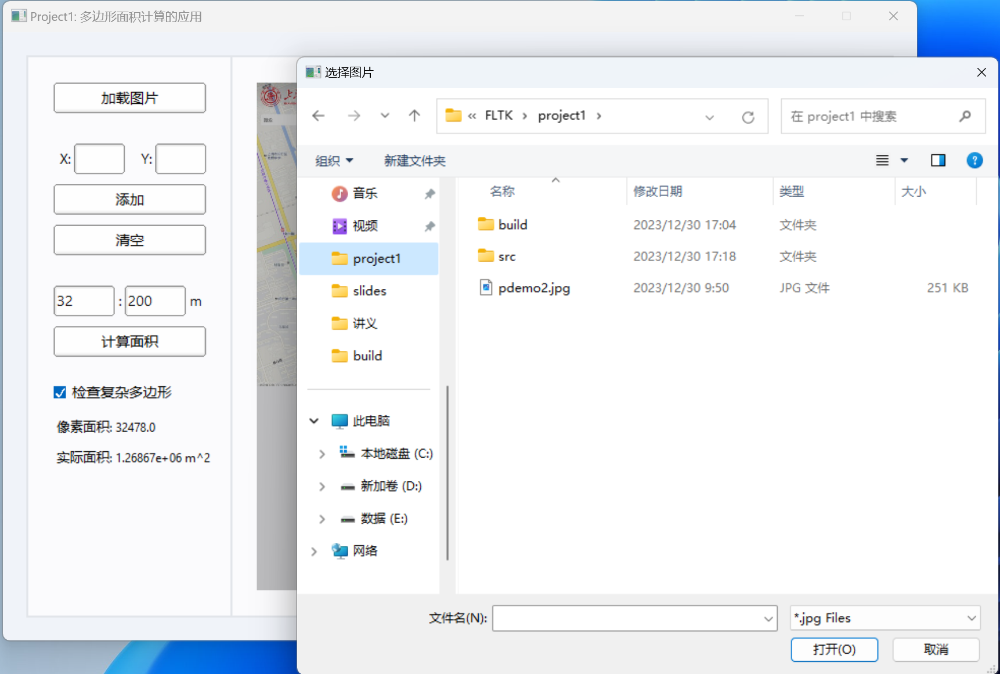
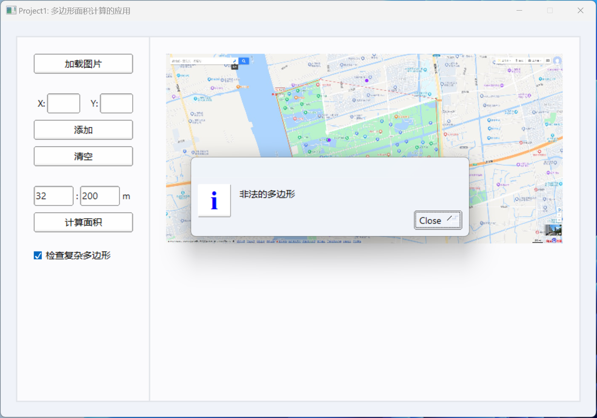

## Project1: 多边形面积计算的应用

UNIkeEN

> 这是 2023 Fall SJTU CS2309 问题求解与实践的课程项目，本项目遵守 MIT 开源协议。

### 编译与运行

请参考 [Link](https://github.com/UNIkeEN/course-notes/blob/main/CS2309_Problem%20solving%20and%20Practice/Homework/FLTK/README.md)

### 问题描述

使用 FLTK 设计界面，预期读入地图截图，标记若干数据点并输入比例尺。若数据点按序合围可构成多边形，则高亮显示合围区域并计算像素面积与实际面积。

#### 图片文件读入

使用 `Fl_Native_File_Chooser` 唤起系统对话框以打开文件，仅允许本程序支持的 JPG 格式图片（`.jpg`）。

```C++
fileChooser = new Fl_Native_File_Chooser();
fileChooser->filter("*.jpg");
fileChooser->title("选择图片");
```

* 打开其他格式文件或图片文件损坏时无效
* 根据题目要求，图片文件大于 1200*1000 像素时将提示“文件过大”
* 程序中的图片显示框为 600*500 像素，图片大于此像素时将会缩放并记录缩放比例

#### 数据点的输入和表示

数据点坐标使用 `double` 精度存储。程序实现了两种数据点的输入方式：

* 使用左侧文本框输入点的坐标（取左上角为原点；对于经过缩放显示的图片，输入坐标仍参考原图的像素坐标系），点击“添加”后增加数据点。
  * 输入为空、非数字或其他非法情况时报错
  * 输入坐标超出原图范围时报错
  * 输入坐标与之前输入重复时报错
* 在图片上点击以添加数据点，这一功能是通过创建显示图片的 `Fl_Widget` 并重载其 `handle()` 函数实现的。

* 添加的数据点在图中对应位置以紫色圆形显示

* 添加数据点后，左侧“清空”按钮变为可用，点击则清空已经添加的数据点

#### 面积计算

* 计算面积时，首先判断数据点按序合围的多边形是否合法：

  * 数据点过少或全部共线时报错
  * 构成复杂多边形时报错（在程序界面提供单选框，供用户决定此项是否检查）

* 对于简单多边形，使用“高斯面积公式”遍历每一对相邻顶点（包括第一个和最后一个也算一对相邻）$(x_i, y_i)$ 和 $(x_j, y_j)$，对于每一对顶点，执行以下计算：

    $$
    A += (x_j + x_i) \times (y_j - y_i)
    $$

    完成计算后，$A$的一半取绝对值，除以显示缩放比例的平方，即为所求像素面积（对于经过缩放显示的图片，这一计算结果标仍参考原图的像素坐标系）；再与比例尺进行计算得到实际面积。

* 根据题目要求，面积结果保留不超过 6 位有效数字并四舍五入，为保证和样例的一致性，采用手动四舍五入（结合 `pow` 和 `floor`）而非直接使用 `setprecision` 等使用银行家舍入的库函数。

> 复杂多边形的面积计算尚未支持（TBD）

#### 其他问题

##### 合围高亮显示

计算面积时，合围多边形会在地图中以蓝色高亮显示，其余部分出现阴影遮罩效果。这一过程实现的过程是：

1. 创建临时的 `Fl_Image_Surface` 对象，设置其为当前绘制表面
2. 按数据点绘制实心多边形
3. 建立新的四通道数组并复制该对象的 RGB 通道 -> 在 Alpha 通道添加半透明度
4. 转化为半透明的 `Fl_RGB_Image` 对象
5. 将显示设备的当前表面设置回默认设备，`draw` 以绘制
6. 释放临时变量空间

##### 界面美化

* 在 FLTK 已有界面主题（`scheme`）的基础上，通过修改配色字体、绘制背景卡片，实现类 Windows 11 的设计风格。
  
* 实现自定义多选框组件，框和“√”均为自行绘制。

### 运行演示

#### 测试用例 1

该样例同验收标准举例。输入点 (332,122),(467,77),(815,136),(834,461),(391,350)；比例尺 32:200m

输出像素面积 137395，真实面积 5.36697 $\times 10^6m^2$，与样例相同。运行截图如下：

<p align="center">
  
  <br>
  <a>图 1：测试用例 1 运行截图</a>
</p>

#### 测试用例2

该样例中点为手动点击输入，位置见图，比例尺 32:200m（不保证真实）

输出像素面积 32478，真实面积 1.26867 $\times 10^6m^2$，运行截图如下：

<p align="center">
  
  <br>
  <a>图 2：测试用例 2 运行截图</a>
</p>

#### 更多截图

<p align="center">
  
  <br>
  <a>图 3：打开文件对话框</a>
</p>

<p align="center">
  
  <br>
  <a>图 4：报错信息（以多边形非法为例）</a>
</p>

