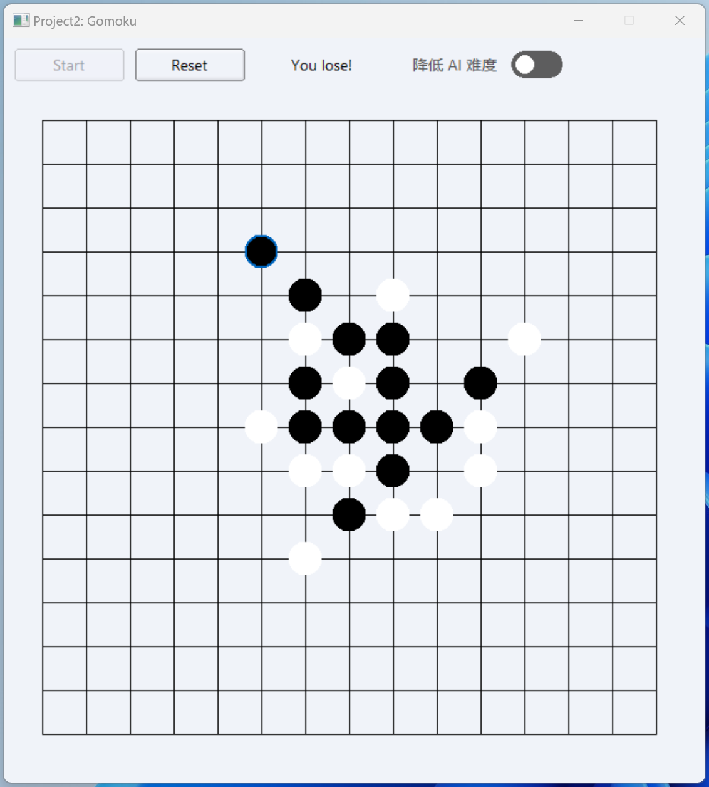

## Project2: 五子棋 Gomoku

UNIkeEN

> 这是 2023 Fall SJTU CS2309 问题求解与实践的课程项目，本项目遵守 MIT 开源协议。

### 编译与运行

请参考 [Link](https://github.com/UNIkeEN/course-notes/blob/main/CS2309_Problem%20solving%20and%20Practice/Homework/FLTK/README.md)

### 问题陈述

使用 FLTK 设计界面，实现用户与 AI 对弈的五子棋。用户可选择 AI 难度、执黑或执白随机。

#### 界面布局与棋盘绘制

* 整体界面在 FLTK 已有界面主题（`scheme`）的基础上，通过修改配色字体、**实现类似 Windows 11 的设计风格**。
  * 界面上方为菜单区，左侧为“开始”和“重置”两个按钮，分别代表开始游戏与重置棋盘状态
  * 菜单区中间为信息显示栏，开始游戏时将显示玩家随机到的颜色，任意一方胜利或平局时将显示结果，状态重置时将显示“Game Reset”
  * 菜单区右侧为难度选择开关，选择对弈的 AI 难度，**Win 11 风格的开关组件自行编写，可以复用且实现了开、关、失效三种颜色样式**，游戏开始后开关失效

* 界面下方为棋盘部分，整体是一个 `Fl_Widget`。
  * 重载 `handle()` 函数，点击时计算距离点击位置最近的网格格点，如果空则完成下棋
  * 最近一步棋额外绘制蓝色边框

#### MinMax 对抗搜索算法

极大极小（Min-Max）搜索算法在零和博弈（参与者之间利益存在完全对立关系的博弈，典型代表即五子棋、围棋）中应用广泛。其核心思想是构建一棵决策树，最小化对手在你的最佳行动后可能获得的最大利益，决策树中的每个节点代表游戏的一个可能状态。

算法执行时，Min 和 Max 两个操作交替进行。Max 轮次尝试选择能使得自己利益最大化的行动；而在 Min 轮次，假设对手会选择能使得你的利益最小化的行动。通过这种方式，算法评估并选择出在最坏情况下仍然是最优的行动。通常，Min-Max算法会在决策树的某个深度上停止扩展，并使用**启发式函数**来评价非终端节点的状态（即计算某一状态下双方玩家的利益），并为先手添加优势。

本项目采用的启发函数遍历棋盘上已有的落子，沿各方向查看其邻近共8个位置，计算对应棋型并将相应得分乘以棋盘位置权重（越靠中间越大）。AI 方总得分减去假定玩家方即为当前局势得分。

> 本项目的 MinMax 评估函数是随手写的，有点智障 OvO

#### Alpha-Beta 剪枝

原始的 Min-Max 算法蕴含“穷举”的思想，即遍历能访问到的所有可能情况。在棋盘大小为 $15\times 15$ 的本场景中，这一思想对求解效率影响极大——每个状态都可能有 $\geq200$ 个子节点，时间复杂度随搜索层数指数级上升。由此引入Alpha-Beta剪枝对Min-Max搜索进行优化，它通过剪去不会影响最终决策的树枝来减少算法需要搜索的节点数。算法中有两个参数在搜索树传递并更新：

* $\alpha$: 在Max轮次被更新，记录当前节点的各个子节点中的最大值，如果子节点被剪枝了，那就是抛去被裁剪部分之后的最大值。
* $\beta$: 在Min轮次被更新，记录当前节点的各个子节点中的最小值，如果子节点被剪枝了，那就是抛去被裁剪部分之后的最小值。

在搜索过程中，如果某个Max轮次节点出现 $\alpha\geq \beta$ ，该极大节点后面的搜索到的值肯定会大于 $\beta$，因此一定不会被其上层Min轮次节点所选用，故其剩余子树可被剪枝。在Min轮次节点同理

核心代码如下：

```c++
std::pair<int, std::pair<int, int>> minimax(
    const Grid& grid, int depth, int playerColor, bool isMaxPlayer, int alpha, int beta) {
    if (depth == 0) {
        return {evaluate(grid, playerColor), {-1, -1}};
    }

    std::pair<int, int> bestMove = {-1, -1};
    if (isMaxPlayer) { // Maximizing player
        int maxEval = INT_MIN;
        for (int r = 0; r < gridSize; r++) {
            for (int c = 0; c < gridSize; c++) {
                if (grid[r][c] == 0) {
                    Grid newGrid = grid;
                    newGrid[r][c] = playerColor;
                    int eval = minimax(newGrid, depth - 1, playerColor, false, alpha, beta).first;
                    if (eval > maxEval) {
                        maxEval = eval;
                        bestMove = {r, c};
                    }
                    alpha = alpha > eval ? alpha : eval;
                    if (beta <= alpha) break;
                }
            }
        }
        return {maxEval, bestMove};
    } else { // Minimizing player
        int minEval = INT_MAX;
        for (int r = 0; r < gridSize; r++) {
            for (int c = 0; c < gridSize; c++) {
                if (grid[r][c] == 0) {
                    Grid newGrid = grid;
                    newGrid[r][c] = -playerColor;
                    int eval = minimax(newGrid, depth - 1, playerColor, true, alpha, beta).first;
                    if (eval < minEval) {
                        minEval = eval;
                        bestMove = {r, c};
                    }
                    beta = beta < eval ? beta : eval;
                    if (beta <= alpha) break;
                }
            }
        }
        return {minEval, bestMove};
    }
}

```

#### 结束状态判断

每轮任意一方落子后，程序均检查是否结束（有玩家胜利或平局）。因为棋盘状态从对战变为结束，只可能与最后落子有关（落子后出现连五，一方胜利；落子后未出现连五且棋盘已满，平局）。

检查结束的方法即，对落子所在的四个方向依次寻找是否有五子连珠。若无则使用 `std::any_of` 检测棋盘是否全满（平局）。

### 运行演示

#### 测试用例 1

本局选择正常 AI 难度，玩家执白，失败

<p align="center">
  
  <br>
  <a>图 1：测试用例 1 运行截图</a>
</p>

#### 测试用例2

本局选择低 AI 难度，玩家执黑，胜利

<p align="center">
  
  <br>
  <a>图 2：测试用例 2 运行截图</a>
</p>


